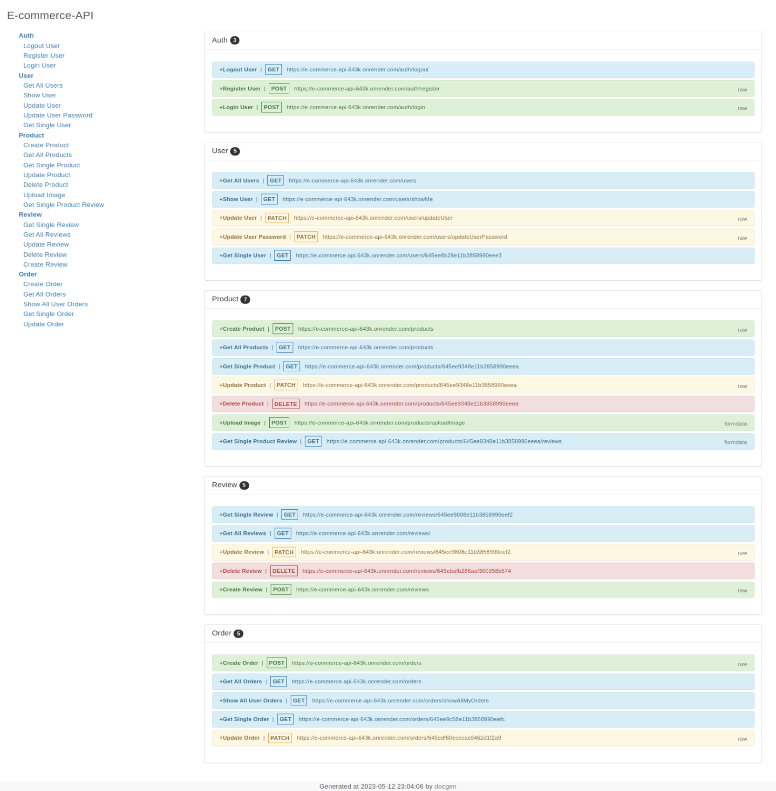

# e-commerce-api


## 📃About The Project

### E-commerce-api API using NodeJS, ExpressJS and MongoDB

## View Demo

https://e-commerce-api-643k.onrender.com



#### installing Locally

1. Clone the repo

   ```sh
   git clone git@github.com:brunoanunciacaosouza/e-commerce-api.git
   ```

2. go to project folder

   ```sh
   cd e-commerce-api
   ```

3. install dependencies

   ```bash
   npm run install
   ```

4. Environmental Variables Set up

   - Here are the environmental variables that needs to be set in the `.env` file in the **server directory**.
   - These are the default setting that I used for development, but you can change it to what works for you.

   ```
     PORT=3000
     MONGO_URL=<Your mongodb url>
     JWT_LIFETIME=1d
     JWT_SECRET=<any secret value of your choice>
   ```

5. Run development server

   ```sh
   npm start
   ```
